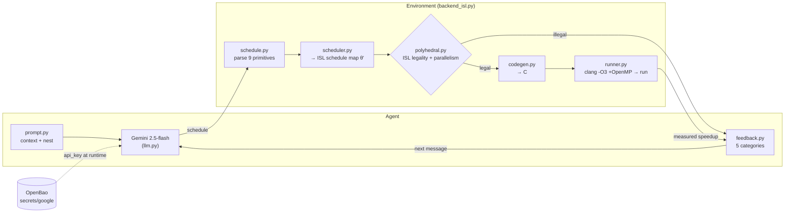
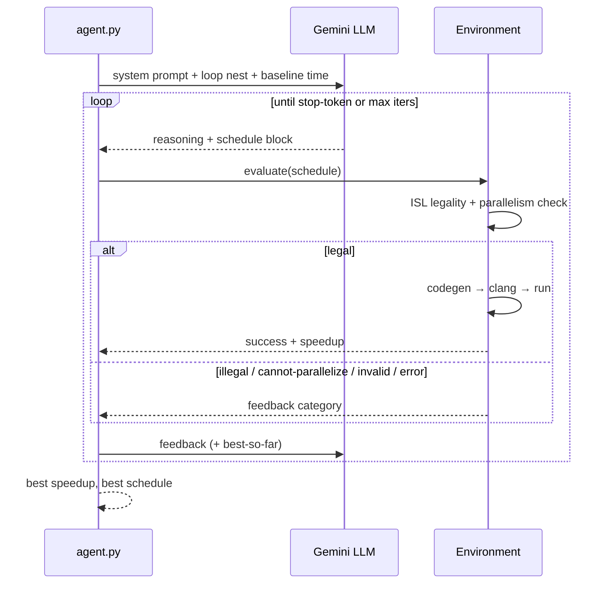
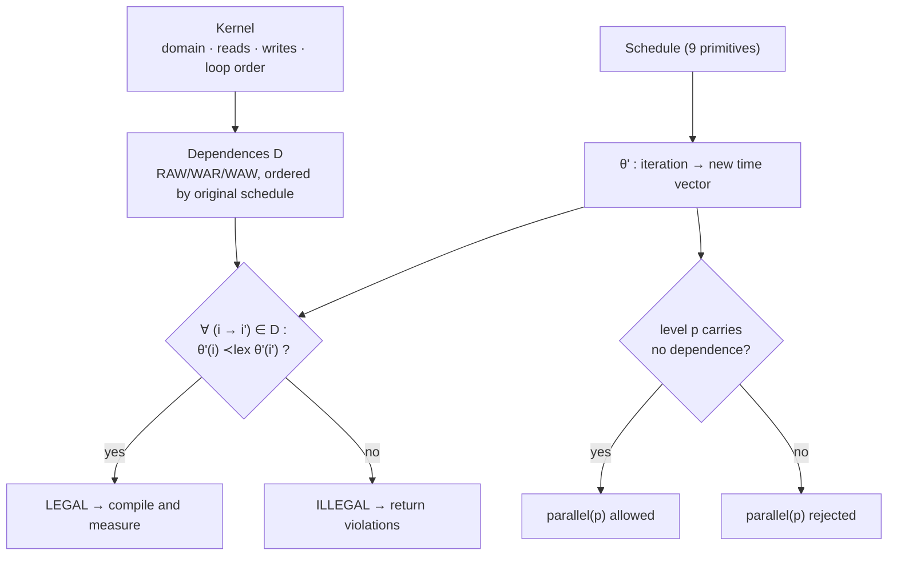
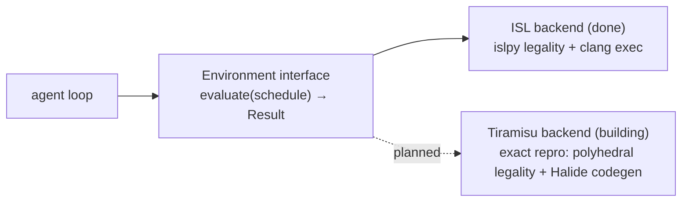

# cluster_compilot

A faithful, from-scratch implementation of **ComPilot** — *Agentic Auto-Scheduling: LLM-Guided Loop Optimization* ([arXiv:2511.00592](https://arxiv.org/abs/2511.00592), Merouani, Kara Bernou & Baghdadi, PACT 2025).

An off-the-shelf LLM acts as an agent that proposes loop transformations. A compiler-grade **polyhedral legality engine** proves whether each schedule is legal, and the transformed code is compiled and **executed for real wall-clock speedup**. The LLM iterates on that feedback. No fine-tuning.

> **Status:** the agent runs live. Gemini 2.5-flash + ISL legality + clang execution reach **42× on GEMM** end-to-end. See [Roadmap](#status--roadmap).

The paper checks legality with **Tiramisu** (a polyhedral compiler that wraps ISL). We use **ISL directly** (`islpy`) — the *same* legality mechanism — plus `clang -O3 + OpenMP` for measurement. An exact Tiramisu backend is being built in parallel for repro parity.

---

## Architecture



## The optimization dialogue



## Polyhedral legality (the faithful core)



The LLM may propose anything; ISL **proves** legality before any code runs — so a wrong proposal is rejected, never miscompiled. `reverse(k)` and `parallel(k)` on GEMM are correctly rejected (the `k` loop carries the reduction).

## Backend abstraction



---

## Install

```bash
pip install -r requirements.txt          # islpy, certifi
brew install libomp                       # OpenMP for clang on macOS
# LLM key: set GEMINI_API_KEY, or store it in OpenBao at secrets/google (field api_key)
```

## Usage

```bash
python3 -m tests.test_legality            # prove the legality oracle (10/10)
python3 -m tests.test_environment         # legality + real measured speedup on GEMM
python3 run_agent.py --mock               # full agent loop, scripted, no API key
python3 run_agent.py --iters 15           # live Gemini (key from env or OpenBao)
python3 run_agent.py --k 5 --iters 20     # best-of-5
```

## Repo layout

| File | Role |
|---|---|
| `compilot/kernels.py` | kernels as schedulable loop nests (exec spec) |
| `compilot/schedule.py` | parse the 9-primitive schedule DSL |
| `compilot/scheduler.py` | transforms → ISL schedule map θ' |
| `compilot/polyhedral.py` | **ISL legality + parallelism oracle** |
| `compilot/codegen.py` | emit timed C from a schedule |
| `compilot/runner.py` | compile (`clang -O3 +OpenMP`) + run + parse |
| `compilot/backend_isl.py` | `Environment`: legality → codegen → measured speedup |
| `compilot/prompt.py` | context prompt + nest presentation |
| `compilot/feedback.py` | 5 feedback categories |
| `compilot/llm.py` | Gemini REST client + mock driver |
| `compilot/secrets.py` | fetch key from OpenBao at runtime |
| `compilot/agent.py` | dialogue loop + best-of-K |
| `compilot/polyhedral_multi.py` | **multi-statement** legality (N statements, 2d+1 schedule) |
| `compilot/backends/tiramisu.py` | drive the **real** libtiramisu legality (exact backend) |
| `eval.py` | run the agent across kernels → per-kernel + **geomean** |
| `run_agent.py` | run the agent on one kernel (`--mock` / live / `--k`) |
| `tests/` | legality (10/10), environment, **Tiramisu parity (4/4)**, multi-statement (3/3) |
| `third_party/tiramisu/` | exact Tiramisu backend — **built** (`libtiramisu.dylib`); gitignored |

**Kernels:** `gemm` (C=A·B), `syrk` (C=A·Aᵀ), `syr2k` (C=A·Bᵀ+B·Aᵀ), `floydwarshall` (sound-legality showcase).

## The 9-primitive schedule DSL

```
interchange(La, Lb)              reorder(La, Lb, Lc, ...)
tile(L, T)                       tile2d(La, Lb, Ta, Tb)      tile3d(La, Lb, Lc, Ta, Tb, Tc)
parallel(L)                      unroll(L, F)
skew(Ltarget, Lsrc, factor)      reverse(L)
```
Legality is checked for all nine; execution currently covers the first seven (skew/reverse codegen in progress; `fuse`/`shift` need the multi-statement model).

## Status & roadmap

**Working & live:**
- ISL legality oracle (10/10) + parallelism check; 9-primitive DSL; clang/OpenMP execution
- Full agent dialogue (prompt/parser/5-category feedback/ICL history/stop/best-of-K), Gemini via OpenBao
- **Live: 42× on GEMM; eval geomean 13.07×** across kernels (gemm 34.6× / syrk 4.9×)
- 4 kernels + `reverse` codegen + in-place reset
- **Exact Tiramisu backend BUILT** (`libtiramisu.dylib` @ `041afad`) and driven from `backends/tiramisu.py`; ISL ↔ real-Tiramisu legality agrees **4/4**
- **Multi-statement polyhedral model** (3/3) — gate for fuse/shift + multi-statement kernels

**Pending:**
- **A.** codegen+execution via Tiramisu's Halide path (speedup from Tiramisu; clang already measures it)
- **B.** wire `fuse`/`shift` + multi-statement codegen → add 2mm/gemver/atax/bicg → full PolyBench/C 4.2.1 (150 instances); `skew` codegen; Pluto baseline; bootstrap 95% CIs; ComPilot@T / ComPilot_K@T; token/cost (RQ2)

## Reference

Merouani, Kara Bernou, Baghdadi. *Agentic Auto-Scheduling: An Experimental Study of LLM-Guided Loop Optimization.* PACT 2025. arXiv:2511.00592.
