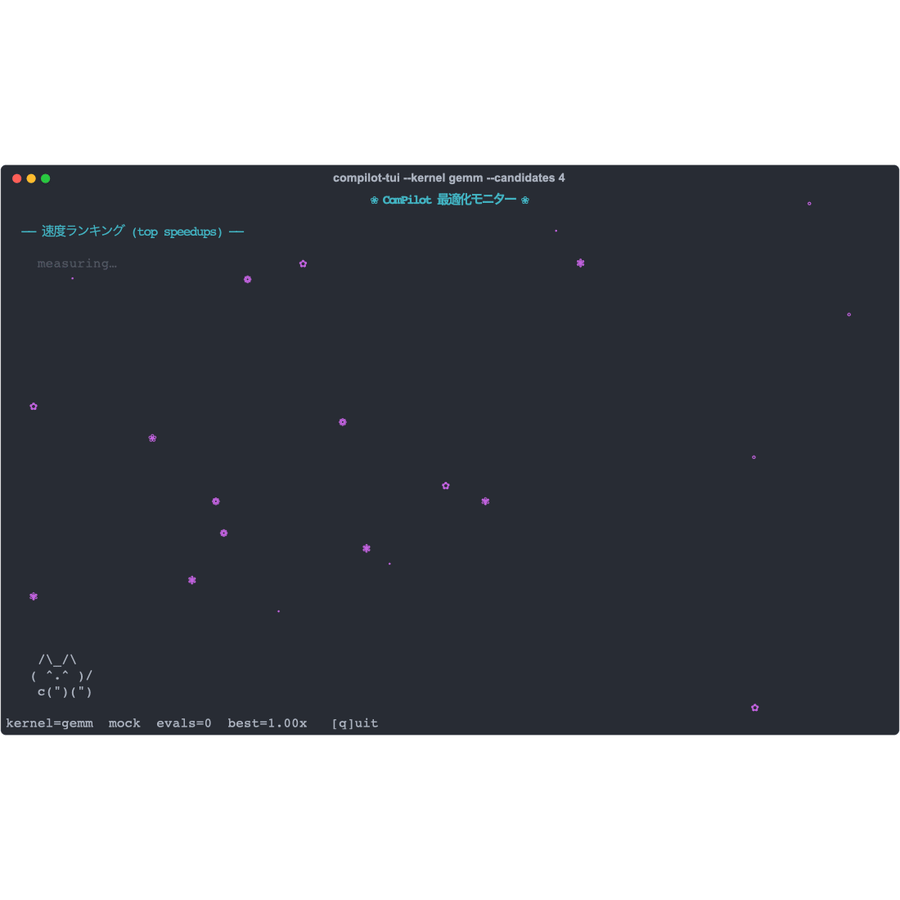
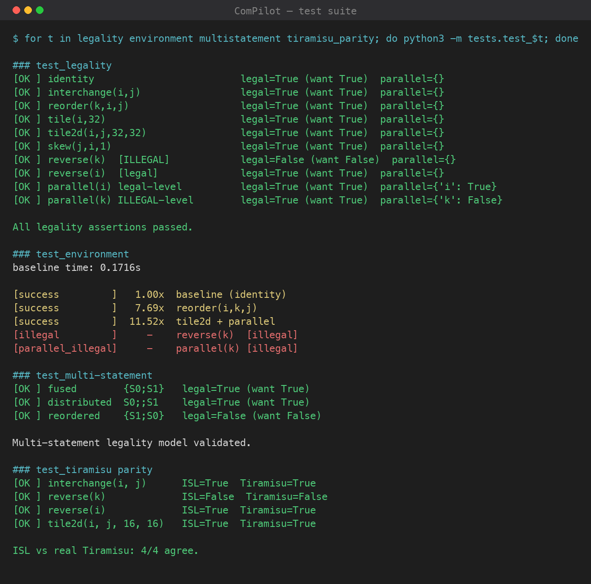

# cluster_compilot

A faithful, from-scratch implementation of **ComPilot** — *Agentic Auto-Scheduling: LLM-Guided Loop Optimization* ([arXiv:2511.00592](https://arxiv.org/abs/2511.00592), Merouani, Kara Bernou & Baghdadi, PACT 2025).

An off-the-shelf LLM acts as an agent that proposes loop transformations. A compiler-grade **polyhedral legality engine** proves whether each schedule is legal, and the transformed code is compiled and **executed for real wall-clock speedup**. The LLM iterates on that feedback. No fine-tuning.

> **Status:** runs live. Gemini 2.5-flash + ISL legality + clang execution reach **42× on GEMM** end-to-end. We also build the **real Tiramisu compiler** and cross-validate our legality against it (**4/4**).

**Live — the agent optimizing GEMM in the TUI monitor** (`compilot-tui`): the speedup leaderboard fills in as schedules are compiled and measured. 🌸




## Documentation

Full docs live in [`docs/`](docs/):

| Doc | What's in it |
|---|---|
| [Architecture](docs/architecture.md) | The four diagrams (rendered + live mermaid): system, dialogue, legality, backends |
| [How it works](docs/how-it-works.md) | Evaluation pipeline (parse → θ′ → ISL legality → measure), feedback categories, the DSL |
| [Building (step by step)](docs/building.md) | Prereqs → deps → key → smoke test → optional Tiramisu build |
| [User guide (step by step)](docs/user-guide.md) | Run the agent, eval, benchmark, tests; write schedules; add a kernel |
| [Test results](docs/test-results.md) | Real test + benchmark output, with screenshots |

## Quick start

Requires **Python 3.14+** (`islpy 2026.1` ships `cp314` wheels; see [Parallelism](#parallelism-python-314) below for why).

```bash
git clone https://github.com/cluster2600/cluster_compilot.git
cd cluster_compilot
python3.14 -m venv .venv && . .venv/bin/activate
pip install -e .                       # islpy, certifi (from pyproject; requires-python >=3.14)
brew install libomp                    # OpenMP for clang (macOS)

python3 -m tests.test_legality         # prove the legality oracle (10/10)
python3 -m tests.test_parallel_safety  # parallel evaluate() == serial verdicts
python3 run_agent.py --mock            # full agent loop, no API key
python3 run_agent.py --iters 15        # live Gemini (key from env or OpenBao)
python3 run_agent.py --k 5 --candidates 4   # parallel best-of-5, 4 candidate schedules/turn
python3 run_agent.py --backend local --base-url http://localhost:11434/v1 \
        --model qwen2.5-coder:32b           # any OpenAI-compatible server (Ollama/vLLM/NIM/LM Studio)
python3 run_agent.py --moa "gemini:gemini-2.5-flash,local:qwen2.5-coder:32b" \
        --aggregator gemini:gemini-2.5-pro  # Mixture of Agents (pool & measure)
```

### Parallelism (Python 3.14)

The search fans out across threads in two places:

- **best-of-k** — the K independent dialogues run concurrently (`ThreadPoolExecutor`).
- **candidates per turn** — `--candidates N` lets the LLM propose up to N schedules in one turn, compiled and measured in parallel.

This scales on the **standard** interpreter because the heavy work releases the GIL: the LLM HTTP calls and the `clang` compile/run are I/O- and subprocess-bound. (Free-threaded `3.14t` is *not* used — `islpy` ships no `cp314t` wheel, and it would add little here since the in-process polyhedral work is a small slice.) Two locks keep this correct:

- **legality lock** (`backend_isl._ISL_LOCK`) — islpy builds objects in a process-global, non-thread-safe ISL context, so the (fast) `build_theta`/`is_legal`/`is_parallel` section is serialized; compile/run stays outside it.
- **measurement lock** (`runner._RUN_LOCK`) — only one *timed* binary executes at a time. Concurrent benchmark processes would contend for cores/caches and bias the very wall-clock speedup being optimized; compiles and LLM calls still overlap, so the search is parallel while the numbers stay trustworthy.

### Mixture of Agents (`--moa`) + local models

A third fan-out axis, in the spirit of [Hermes' Mixture of Agents](https://hermes-agent.nousresearch.com/docs/user-guide/features/mixture-of-agents): each turn, several **reference** models propose schedules in parallel and an **aggregator** model synthesizes its own informed by theirs. Unlike Hermes — which has no ground-truth evaluator and lets the aggregator pick — ComPilot is **pool & measure**: every proposal (references' and aggregator's) is deduped, compiled, and **measured** by the real oracle in parallel, and the best measured speedup wins. Diverse proposers, objective selection.

```bash
python3 run_agent.py --moa "gemini:gemini-2.5-flash,local:qwen2.5-coder:32b" \
        --aggregator gemini:gemini-2.5-pro --candidates 2
```

Each model is a `backend:model` spec (`gemini:…`, `local:…`, `mock`; split on the first `:`, so Ollama tags like `qwen2.5-coder:32b` survive). References run hotter (0.9) for diversity, the aggregator cooler (0.4). MoA covers both single- and multi-statement kernels (for multi-statement, each agent proposes one complete schedule set — one block per statement — and whole sets are pooled and measured).

**Local models** use one OpenAI-compatible client (`compilot/llm.OpenAIClient`) against `/v1/chat/completions` — Ollama (`…/v1`), vLLM, NVIDIA NIM, LM Studio, llama.cpp. Point `--backend local --base-url` at the server, or mix providers per-agent via `--moa` specs. `OPENAI_API_KEY` is sent as a bearer token when set (unused by Ollama).

See the [building guide](docs/building.md) and [user guide](docs/user-guide.md) for everything else (live keys, Tiramisu build, adding kernels).

### MCP server + TUI monitor

Two extra entry points (installed by `pip install -e .`):

```bash
compilot-tui --kernel gemm --candidates 4    # live curses monitor: speedup leaderboard + falling sakura 🌸
compilot-tui --kernel 2mm --moa mock,mock --aggregator mock   # watch MoA fan-out (multi-statement)
compilot-mcp                                  # MCP stdio server (Claude Code / Codex)
```

The **MCP server** (`compilot/mcp_server.py`, hand-rolled stdio JSON-RPC — no SDK dep) exposes three tools: `list_kernels`, `check_legality(kernel, schedule)` (ISL verdict + measured speedup, sub-second, no LLM), and `optimize(kernel, backend=mock, …)` (the full agent loop). Wire it into Claude Code or Codex via the npm launcher — see [`npm/README.md`](npm/README.md):

```bash
COMPILOT_PYTHON=$PWD/.venv/bin/python claude mcp add compilot -- npx -y @cluster2600/compilot-mcp
```

The **TUI** (`compilot/tui.py`, stdlib `curses`) watches the parallel search live via a lightweight `on_eval` hook on every runner — single-statement, multi-statement, and MoA fan-out all stream measured candidates into a top-speedups board while a maneki-neko waves on each new record. `--backend mock` runs offline; add `--moa <specs>` to watch the Mixture-of-Agents pool.

## Test results

All suites pass; the benchmark is reproducible (`python3 bench.py`). Full output + screenshots in [docs/test-results.md](docs/test-results.md).



| Suite | Result |
|---|---|
| `test_legality` | **10/10** — accepts interchange/tile/skew; rejects `reverse(k)`; flags `parallel(k)` |
| `test_environment` | GEMM `reorder` ~7.7×, `tile2d+parallel` ~11–14×; illegal schedules rejected pre-execution |
| `test_multistatement` | **3/3** — fused/distributed legal, reordered illegal |
| `test_tiramisu_parity` | **4/4** — our ISL engine agrees with the real Tiramisu compiler |

**Benchmark (deterministic):** gemm ~26–31× · syrk ~5× · syr2k ~5× · floyd ~1× (correctly un-parallelizable) → **geomean ~5×**. Live Gemini: **42× GEMM**, ~13× geomean.

## Repo layout

| File | Role |
|---|---|
| `compilot/kernels.py` | kernels as schedulable loop nests (exec + poly specs, `REGISTRY`) |
| `compilot/schedule.py` | parse the 9-primitive schedule DSL |
| `compilot/scheduler.py` | transforms → ISL schedule map θ′ |
| `compilot/polyhedral.py` | **ISL legality + parallelism oracle** |
| `compilot/polyhedral_multi.py` | multi-statement **legality** (2d+1 schedules) |
| `compilot/multikernel.py` | multi-statement **execution** (sequence of statements, e.g. 2mm) |
| `compilot/codegen.py` · `runner.py` | emit timed C · compile (`clang -O3 +OpenMP`) + run |
| `compilot/backend_isl.py` | `Environment`: legality → codegen → measured speedup |
| `compilot/backends/tiramisu.py` | drive the **real** libtiramisu legality |
| `compilot/prompt.py` · `feedback.py` · `llm.py` · `secrets.py` · `agent.py` | context prompt · 5 feedback categories · Gemini client · OpenBao · dialogue + best-of-K |
| `run_agent.py` · `eval.py` · `bench.py` · `evaluate.py` | run the agent · geomean eval · benchmark · **full metrics (ComPilot@T, CIs, cost)** |
| `tests/` | legality (10/10), environment, multi-statement (3/3), multi-kernel (10 PolyBench), fusion, Tiramisu parity (4/4) |
| `third_party/tiramisu/` | exact Tiramisu backend — **built** (`libtiramisu.dylib`); gitignored |

**Kernels (18):** single — `gemm`, `syrk`, `syr2k`, `syrk_tri`, `syr2k_tri`, `floydwarshall`; multi-statement — `2mm`, `3mm`, `mvt`, `atax`, `bicg`, `gesummv`, `gemver`, `covariance`, `doitgen` (3-D); stencils — `jacobi1d`, `jacobi2d`, `seidel2d`. Spanning matmul, matvec, reduction, **triangular**, **fusion**, **in-place**, **datamining**, **3-D**, and **time-stepped stencils** (jacobi parallelizes; seidel carries dependences → needs skewing, correctly rejected). Drive any of them: `python3 run_agent.py --kernel <name>`.

## Status & roadmap

**Working & live:** ISL legality oracle + parallelism check; **all 9 primitives execute** (incl. `skew`, `reverse`, `fuse`); clang/OpenMP execution; full agent dialogue with Gemini via OpenBao for **both single- and multi-statement** kernels; **10 kernels** (4 single + 6 multi: 2mm/3mm/mvt/atax/bicg/gesummv); exact Tiramisu backend **built** and driven (ISL↔Tiramisu **4/4**); multi-statement legality (3/3) + execution (2mm live **28.6×**); loop **fusion** (gesummv 1.7×); evaluation harness — **ComPilot@T, ComPilot_K@T, bootstrap 95% CIs, token/cost (RQ1/RQ2/RQ9)**.

**Baseline:** `baselines.py` — **ComPilot vs naive auto-parallelization**: geomean **6.17× vs 3.31× → 1.86× faster** (matmul kernels 4.6–6.2× faster; matvec memory-bound, ~1.1–1.35×). Polyhedral **Pluto** itself does **not build** on this toolchain (Darwin-27/clang-22 rejects its bundled piplib's legacy K&R C — `conflicting types`/`unknown type name`; the LLVM-14 clang++ can't link C++), so naive auto-parallel is the proxy comparison.

**Tiramisu backend — complete:** legality (ISL↔Tiramisu **4/4**) + Halide **codegen** (128 KB object) + **execution** (runs+times its own generated code via a Halide-buffer wrapper: tile2d+parallel → **1.7× measured by Tiramisu**).

**Python 3.15:** forward-ready — `requires-python >=3.14` has no upper cap, and the suite is **deprecation-clean** (passes under `-W error::DeprecationWarning`, so nothing 3.15 removes is in use). The only blocker is upstream: `islpy` ships no `cp315` wheel yet (cp310–cp314 only), and a source build needs the ISL C library. Run `python3 check_py315.py` to probe PyPI for the wheel — when it flips to `READY`, `pip install -e .` should work on 3.15 unchanged. (Free-threaded `3.15t` additionally needs a `cp315t` wheel, same as the `3.14t` gap.)

**Pending:**
- **full PolyBench/C 4.2.1 (150 instances)** — **18/30 kernels**; **every computational pattern works** (matmul, matvec, reduction, triangular, multi-statement, fusion, in-place, datamining, time-stepped stencils, **3-D**). The remaining ~12 are loop-carried *solvers* (cholesky/lu/ludcmp/trisolv/durbin — need imperfect-nest codegen) and complex stencils (heat-3d/fdtd-2d/adi), correlation; plus the ×5 size classes

## Reference

Merouani, Kara Bernou, Baghdadi. *Agentic Auto-Scheduling: An Experimental Study of LLM-Guided Loop Optimization.* PACT 2025. arXiv:2511.00592.
