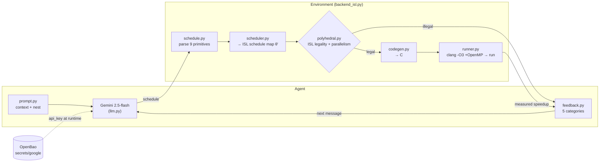
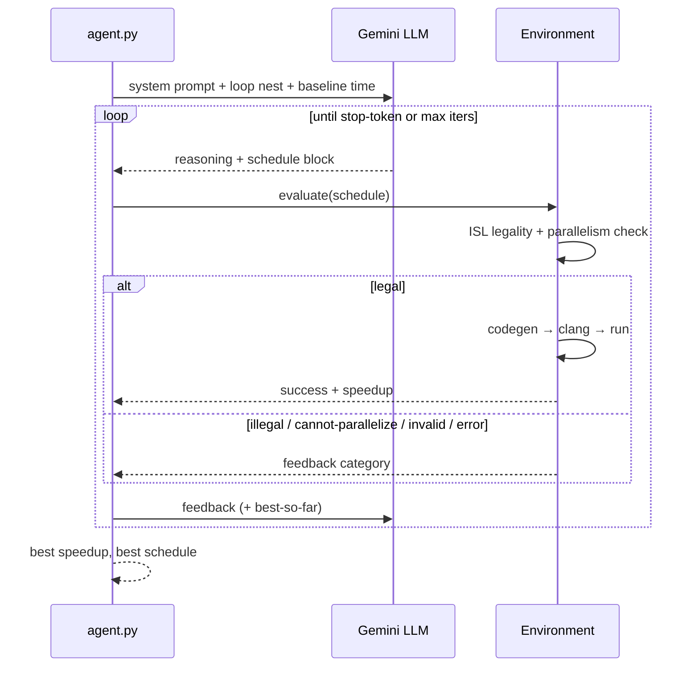
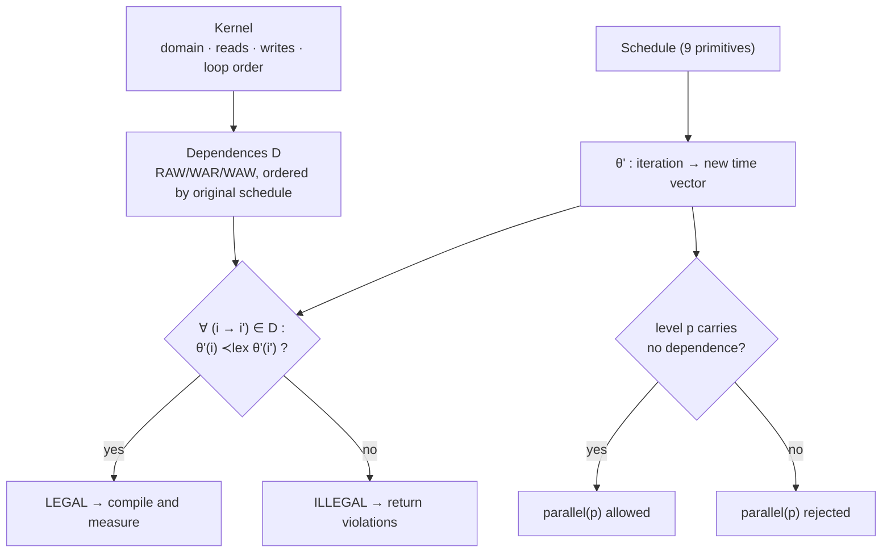
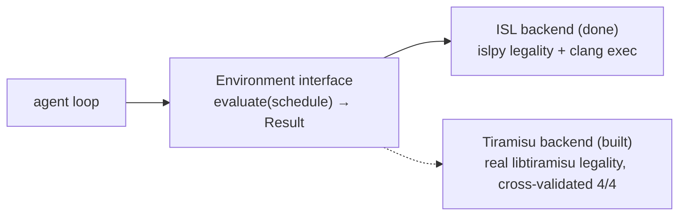

# cluster_compilot

A faithful, from-scratch implementation of **ComPilot** — *Agentic Auto-Scheduling: LLM-Guided Loop Optimization* ([arXiv:2511.00592](https://arxiv.org/abs/2511.00592), Merouani, Kara Bernou & Baghdadi, PACT 2025).

An off-the-shelf LLM acts as an agent that proposes loop transformations. A compiler-grade **polyhedral legality engine** proves whether each schedule is legal, and the transformed code is compiled and **executed for real wall-clock speedup**. The LLM iterates on that feedback. No fine-tuning.

> **Status:** the agent runs live. Gemini 2.5-flash + ISL legality + clang execution reach **42× on GEMM** end-to-end. See [Roadmap](#status--roadmap).

The paper checks legality with **Tiramisu** (a polyhedral compiler that wraps ISL). We use **ISL directly** (`islpy`) — the *same* legality mechanism — plus `clang -O3 + OpenMP` for measurement. An exact Tiramisu backend is being built in parallel for repro parity.

---

## Architecture



## The optimization dialogue



## Polyhedral legality (the faithful core)



The LLM may propose anything; ISL **proves** legality before any code runs — so a wrong proposal is rejected, never miscompiled. `reverse(k)` and `parallel(k)` on GEMM are correctly rejected (the `k` loop carries the reduction).

## Backend abstraction



---

## Documentation

**What ComPilot does.** An LLM is given a loop nest and its baseline runtime, then proposes a *schedule* (a sequence of loop transformations) inside `<schedule>…</schedule>` tags. The environment checks the schedule and returns one of five outcomes; the LLM uses that feedback to refine its next proposal. It keeps the best legal speedup and stops on a stop-token or an iteration cap. No fine-tuning — the intelligence is an off-the-shelf model; correctness comes from the compiler.

**How a proposal is evaluated** (`backend_isl.Environment.evaluate`):
1. **Parse** the schedule (`schedule.py`) into the 9-primitive DSL.
2. **Build θ′** (`scheduler.py`) — the new schedule as an ISL map from each iteration to its new logical time vector.
3. **Prove legality** (`polyhedral.py`): compute all memory dependences `D` (RAW/WAR/WAW, ordered by the original schedule); the schedule is legal iff every dependence stays lexicographically forward under θ′, i.e. `∀ (i→i′) ∈ D : θ′(i) ≺ₗₑₓ θ′(i′)`. A loop level is parallelizable iff no dependence is *carried* at that level.
4. **Measure** (`codegen.py` + `runner.py`): if legal, emit C, compile with `clang -O3 + OpenMP`, run, and report `baseline_time / new_time`. The output checksum is cross-checked against the baseline — a second, independent correctness guard.

**Feedback categories** (`feedback.py`): `success` (with speedup) · `illegal` (dependence violation) · `parallel_illegal` (loop carries a dependence) · `invalid` (unparseable) · `compile/runtime_error`.

**Legality backends.** `backend_isl` uses ISL directly (the same library Tiramisu wraps). `backends/tiramisu.py` drives the **real Tiramisu compiler** we built; the two agree 4/4 on directly-comparable transforms (see [Test results](#test-results)). `polyhedral_multi.py` extends legality to multiple statements (2d+1 schedules), the gate for `fuse`/`shift` and multi-statement kernels.

**Secrets.** The Gemini key is fetched from **OpenBao** at runtime (`secrets.py`) — never written to disk or printed.

## Building (step by step)

**1. Prerequisites** — Python 3.10+, a C compiler with OpenMP, Node (only to validate the README's mermaid).
```bash
brew install libomp        # OpenMP for clang (macOS)
```

**2. Clone + Python deps**
```bash
git clone https://github.com/cluster2600/cluster_compilot.git
cd cluster_compilot
pip install -r requirements.txt        # islpy, certifi
```

**3. LLM key (for live runs)** — either set an env var, or store it in OpenBao:
```bash
export GEMINI_API_KEY=...               # option A
# option B: OpenBao at secrets/google, field api_key (auto-read, must be unsealed)
```

**4. Smoke test** (no key needed)
```bash
python3 -m tests.test_legality          # expect: 10/10
python3 run_agent.py --mock             # full loop, scripted
```

**5. (Optional) Build the exact Tiramisu backend** — only if you want real-compiler parity. This builds LLVM 14 + Halide + ISL + libtiramisu from source (long, ~GBs):
```bash
cd third_party
git clone --recursive https://github.com/Tiramisu-Compiler/tiramisu.git
cd tiramisu && git checkout 041afad
git submodule update --init --recursive
./utils/scripts/install_submodules.sh "$PWD"      # LLVM/Halide/ISL (use `ninja -k 0` if aux tools fail)
cmake --install 3rdParty/Halide/build --prefix "$PWD/3rdParty/Halide/install"
# then configure libtiramisu with: -DHalide_DIR=<install>/lib/cmake/Halide
#   -DCMAKE_PREFIX_PATH=<install> -DCMAKE_POLICY_VERSION_MINIMUM=3.5 -DUSE_MPI=FALSE
make -j tiramisu
python3 -m tests.test_tiramisu_parity             # expect: 4/4
```

## User guide (step by step)

```bash
# 1. Run the full agent loop without a key (scripted driver)
python3 run_agent.py --mock

# 2. Run live on GEMM (key from env or OpenBao)
python3 run_agent.py --iters 15

# 3. Choose a kernel and use best-of-K
python3 run_agent.py --kernel syrk --k 5 --iters 20

# 4. Evaluate across all kernels (per-kernel + geometric mean)
python3 eval.py --mock                     # deterministic
python3 eval.py --kernels gemm,syrk --k 3  # live Gemini, best-of-3

# 5. Run the test suite
python3 -m tests.test_legality
python3 -m tests.test_environment
python3 -m tests.test_multistatement
python3 -m tests.test_tiramisu_parity      # needs the Tiramisu build (step 5 above)
```

**Add your own kernel** — pair an execution spec (`Kernel`) with a polyhedral spec (`PolyKernel`) in `compilot/kernels.py` and register it in `REGISTRY`. The agent, eval, and legality engine pick it up by name. See `GEMM` / `GEMM_POLY` as the template.

## Test results

All suites pass. Captured on a multi-core macOS / Apple-Silicon machine (speedups are machine-dependent; legality verdicts are not).

**Unit / integration tests**

| Suite | Result |
|---|---|
| `test_legality` — ISL oracle distinguishes legal vs illegal | **10/10** (accepts interchange/tile/skew; rejects `reverse(k)`; flags `parallel(k)`) |
| `test_environment` — legality + real measured speedup on GEMM | baseline ≈0.17 s; `reorder(i,k,j)` **7.6×**; `tile2d+parallel` **14.2×**; `reverse(k)`→illegal; `parallel(k)`→parallel_illegal |
| `test_multistatement` — producer→consumer legality | **3/3** (fused legal, distributed legal, reordered illegal) |
| `test_tiramisu_parity` — ISL vs the **real Tiramisu compiler** | **4/4 agree** (interchange, `reverse(k)`=illegal, `reverse(i)`, tile2d) |

**Benchmark** — one strong, legal schedule per kernel (deterministic; `clang -O3 + OpenMP`):

| Kernel | Baseline | Speedup | Schedule |
|---|---|---|---|
| gemm | 0.17 s | **26.5×** | `reorder(i,k,j)` + `tile2d(64,64)` + `parallel(i_t)` |
| syrk | 0.10 s | **5.3×** | `tile2d(64,64)` + `parallel(i_t)` |
| syr2k | 0.11 s | **4.9×** | `tile2d(64,64)` + `parallel(i_t)` |
| floydwarshall | 0.07 s | **0.99×** | `tile2d(64,64)` — *cannot* parallelize under sound legality |
| **geomean** | | **5.1×** | |

Floyd-Warshall at ~1× is the honest, *correct* result: row/column `k` is written and read across iterations, so sound polyhedral analysis forbids parallelizing `i`/`j` (only the non-negative-diagonal *semantics* would allow it — which a syntactic checker cannot assume). Live Gemini reaches **42× on GEMM** and a **13× geomean** when it tailors schedules per kernel.

## Repo layout

| File | Role |
|---|---|
| `compilot/kernels.py` | kernels as schedulable loop nests (exec spec) |
| `compilot/schedule.py` | parse the 9-primitive schedule DSL |
| `compilot/scheduler.py` | transforms → ISL schedule map θ' |
| `compilot/polyhedral.py` | **ISL legality + parallelism oracle** |
| `compilot/codegen.py` | emit timed C from a schedule |
| `compilot/runner.py` | compile (`clang -O3 +OpenMP`) + run + parse |
| `compilot/backend_isl.py` | `Environment`: legality → codegen → measured speedup |
| `compilot/prompt.py` | context prompt + nest presentation |
| `compilot/feedback.py` | 5 feedback categories |
| `compilot/llm.py` | Gemini REST client + mock driver |
| `compilot/secrets.py` | fetch key from OpenBao at runtime |
| `compilot/agent.py` | dialogue loop + best-of-K |
| `compilot/polyhedral_multi.py` | **multi-statement** legality (N statements, 2d+1 schedule) |
| `compilot/backends/tiramisu.py` | drive the **real** libtiramisu legality (exact backend) |
| `eval.py` | run the agent across kernels → per-kernel + **geomean** |
| `run_agent.py` | run the agent on one kernel (`--mock` / live / `--k`) |
| `tests/` | legality (10/10), environment, **Tiramisu parity (4/4)**, multi-statement (3/3) |
| `third_party/tiramisu/` | exact Tiramisu backend — **built** (`libtiramisu.dylib`); gitignored |

**Kernels:** `gemm` (C=A·B), `syrk` (C=A·Aᵀ), `syr2k` (C=A·Bᵀ+B·Aᵀ), `floydwarshall` (sound-legality showcase).

## The 9-primitive schedule DSL

```
interchange(La, Lb)              reorder(La, Lb, Lc, ...)
tile(L, T)                       tile2d(La, Lb, Ta, Tb)      tile3d(La, Lb, Lc, Ta, Tb, Tc)
parallel(L)                      unroll(L, F)
skew(Ltarget, Lsrc, factor)      reverse(L)
```
Legality is checked for all nine; execution currently covers the first seven (skew/reverse codegen in progress; `fuse`/`shift` need the multi-statement model).

## Status & roadmap

**Working & live:**
- ISL legality oracle (10/10) + parallelism check; 9-primitive DSL; clang/OpenMP execution
- Full agent dialogue (prompt/parser/5-category feedback/ICL history/stop/best-of-K), Gemini via OpenBao
- **Live: 42× on GEMM; eval geomean 13.07×** across kernels (gemm 34.6× / syrk 4.9×)
- 4 kernels + `reverse` codegen + in-place reset
- **Exact Tiramisu backend BUILT** (`libtiramisu.dylib` @ `041afad`) and driven from `backends/tiramisu.py`; ISL ↔ real-Tiramisu legality agrees **4/4**
- **Multi-statement polyhedral model** (3/3) — gate for fuse/shift + multi-statement kernels

**Pending:**
- **A.** codegen+execution via Tiramisu's Halide path (speedup from Tiramisu; clang already measures it)
- **B.** wire `fuse`/`shift` + multi-statement codegen → add 2mm/gemver/atax/bicg → full PolyBench/C 4.2.1 (150 instances); `skew` codegen; Pluto baseline; bootstrap 95% CIs; ComPilot@T / ComPilot_K@T; token/cost (RQ2)

## Reference

Merouani, Kara Bernou, Baghdadi. *Agentic Auto-Scheduling: An Experimental Study of LLM-Guided Loop Optimization.* PACT 2025. arXiv:2511.00592.
