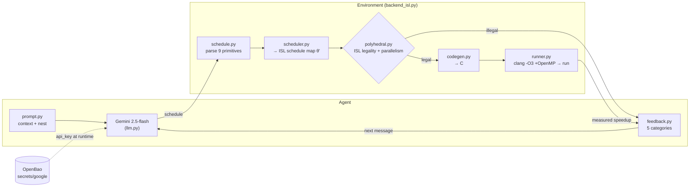
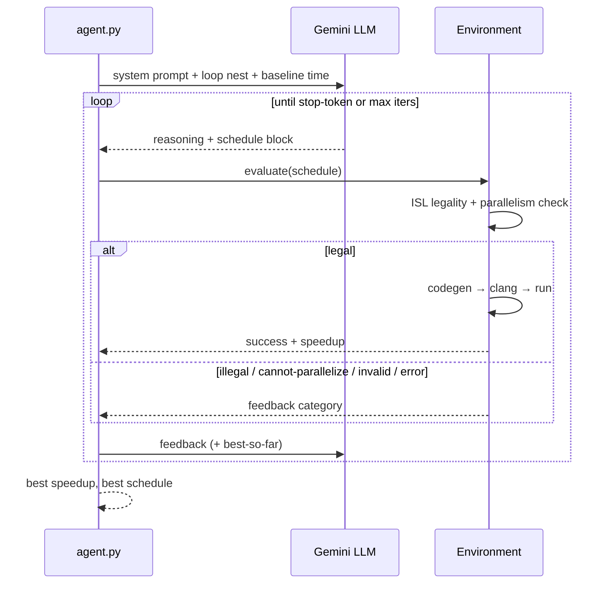
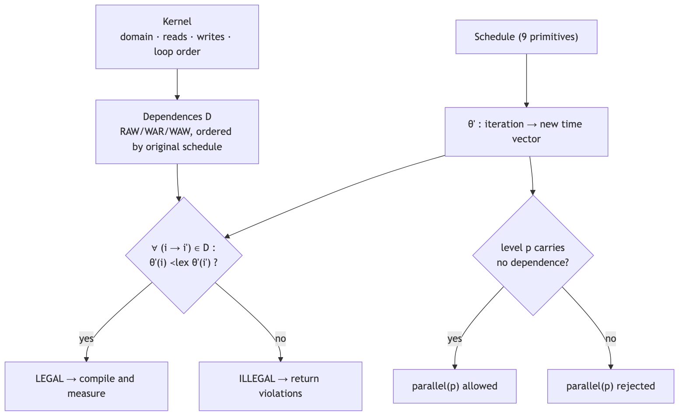
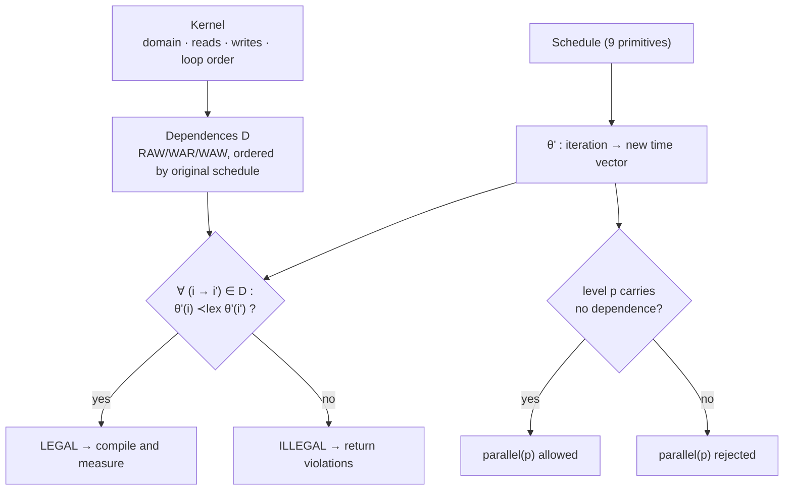
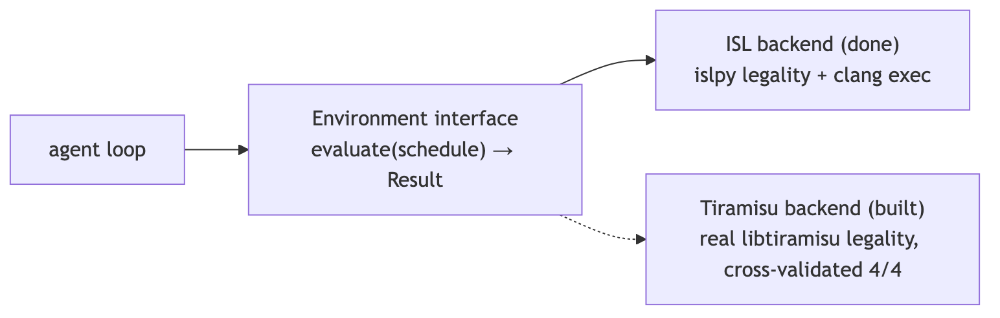
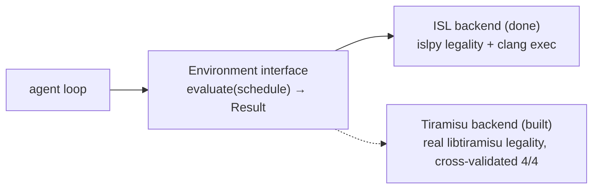
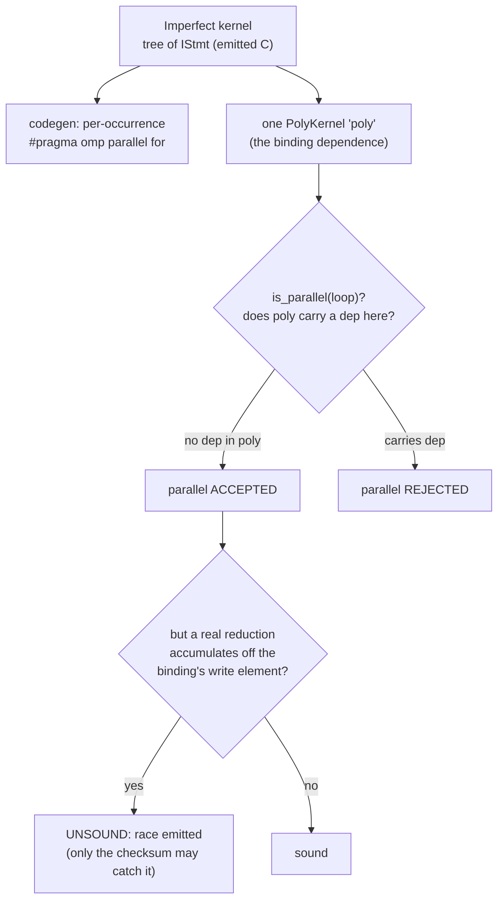

# Architecture

Four views of ComPilot. Each is shown as a rendered image (works everywhere) with its live mermaid source below.

## System architecture

The agent proposes schedules; the environment proves legality (ISL) and measures real speedup (clang). The Gemini key is read from OpenBao at runtime.

mermaid source

## The optimization dialogue

One LLM↔compiler conversation: propose a schedule, evaluate it, feed the outcome back, keep the best legal speedup, stop on the stop-token.

mermaid source

## Polyhedral legality (the faithful core)

A schedule is legal iff every dependence stays lexicographically forward under the new schedule θ′; a loop level is parallel iff it carries no dependence. The LLM can be wrong — this rejects illegal schedules before any code runs.

mermaid source

## Backend abstraction

The same Environment interface is served by the ISL backend (islpy + clang, done) or the real Tiramisu compiler (built, cross-validated 4/4).

mermaid source

## Kernel registries

Four registries in `compilot/kernels.py`, each with its own codegen + environment.
Together they cover the full PolyBench/C 4.2.1 set (30/30) across 5 size classes.

| Registry | Shape | Codegen | Examples |
|---|---|---|---|
| `REGISTRY` | single statement, perfect nest | `codegen.py` | gemm, syrk, syr2k, floyd-warshall |
| `MULTI_REGISTRY` | a sequence of statements | `multikernel.py` | 2mm, 3mm, gemver, covariance, doitgen |
| `STENCIL_REGISTRY` | sequential time loop over spatial sweeps | `stencil.py` | jacobi-1d/2d, seidel-2d, heat-3d, fdtd-2d, adi, deriche |
| `IMPERFECT_REGISTRY` | loop-carried solvers / triangular BLAS (tree nest) | `imperfect.py` | trisolv, lu, cholesky, ludcmp, durbin, gramschmidt, trmm, symm, nussinov |

## Single-binding-statement legality model (imperfect kernels)

Imperfect kernels emit a *tree* of statements (the real C), but legality is decided
against **one** `PolyKernel` that captures the *binding* dependence. Simple, with
one sharp edge: the oracle only sees the dependences you encode. A **reduction that
accumulates into an element other than the binding statement's own write** is
invisible unless modeled explicitly.

This is the class of bug fixed in issues **#9/#10**: `symm`'s `temp2 += …` reduction
(carried on `k`) and `gramschmidt`'s `nrm`/`R[k][j]` reductions (carried on `i`)
accumulate into *different* elements than the binding write, so the oracle wrongly
accepted `parallel(k)` / `parallel(i)` until those reductions were added to `poly`
as virtual accumulator arrays (`acc[i,j]`, `R[k,j]`).

**Rule of thumb:** when adding an imperfect kernel, every loop that runs a reduction
must carry a dependence in `poly`, even if the binding statement's write does not.
The runtime checksum is a backstop, not the proof — a data race can pass a checksum
by luck, so the checksum is also **position-weighted** (`Σ (idx+1)·out[idx]`) to
catch transposed/mirrored writes that an unweighted sum would miss.
