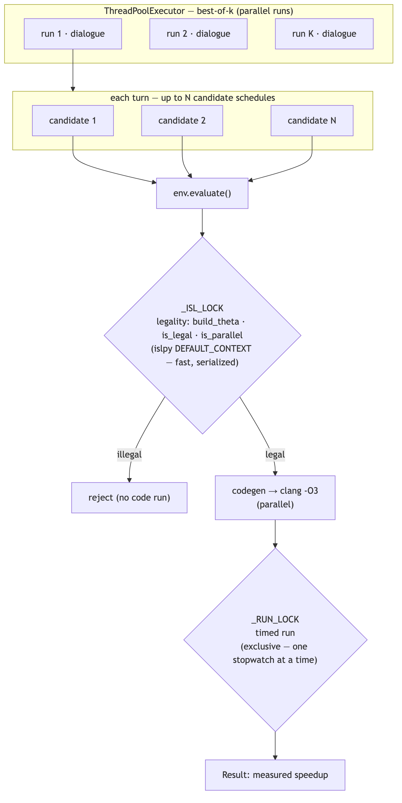
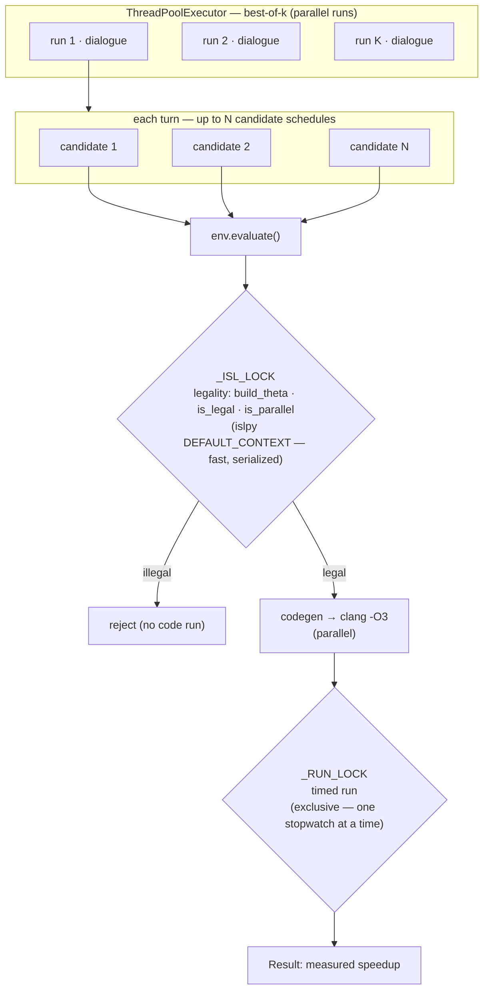
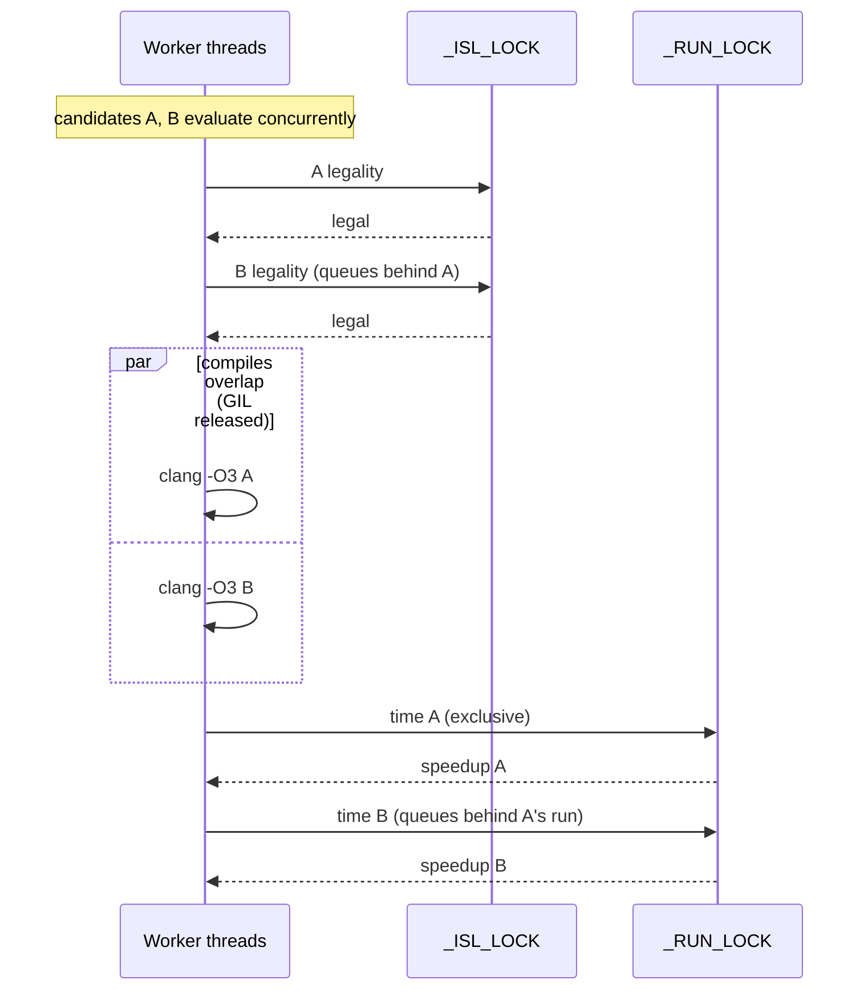

# Parallelism (Python 3.14)

ComPilot requires **Python 3.14+** and fans the search out across threads. The
guiding principle: **parallelize the search, serialize the measurement.** The
expensive work — Gemini calls and the `clang` compile/run — is I/O- and
subprocess-bound and releases the GIL, so threads scale on the *standard*
interpreter. Two locks keep the result correct and the numbers trustworthy.

> Free-threaded `3.14t` is **not** used: `islpy` ships no `cp314t` wheel, and the
> in-process polyhedral work is a small slice of wall-clock anyway, so removing
> the GIL would buy little here.

## Where the fan-out happens

| Axis | Flag | What runs concurrently |
|------|------|------------------------|
| **best-of-k** | `--k K` | the K independent dialogues (each its own LLM client) |
| **candidates / turn** | `--candidates N` | up to N schedules proposed in one turn |

```bash
python3 run_agent.py --k 5 --candidates 4 --iters 20
```

## Fan-out and the two locks

The agent fans out into many concurrent `env.evaluate()` calls. Each call passes
through a fast legality gate (serialized) and an expensive compile/measure stage
(compile parallel, timed run serialized).



<details><summary>mermaid source</summary>



</details>

**Why two locks:**

- **`_ISL_LOCK`** (`backend_isl.py`) — islpy builds every object in a
  process-global ISL context that is *not* thread-safe. The legality section is
  microsecond-to-millisecond cheap, so serializing it costs almost nothing; the
  expensive compile/run stays outside it.
- **`_RUN_LOCK`** (`runner.py`) — only one *timed* binary executes at a time.
  Concurrent benchmark processes contend for cores and caches and would bias the
  very wall-clock speedup the agent optimizes for. Compilation and the LLM calls
  still overlap freely.

## Timeline: compiles overlap, runs don't

Two candidates `A` and `B` evaluated concurrently. Their legality checks and
compiles overlap; only the timed runs are exclusive, so each measurement is taken
on an otherwise-idle machine.


<details><summary>mermaid source</summary>



</details>

## Correctness

`tests/test_parallel_safety.py` hammers a shared environment with hundreds of
concurrent `evaluate()` calls and asserts every schedule's legality **verdict**
matches the serial reference (speedups jitter; status must not):

```
OK: 384 concurrent evaluate() calls, 0 mismatches, verdicts identical to serial.
```

A measured illustration of the measurement lock's effect (mock GEMM, best-of-3):
without it, simultaneous timed runs depressed an honest ~50× to 8–21×; with it,
the runs still interleave (parallel search) while measurements return to ~34–54×.
