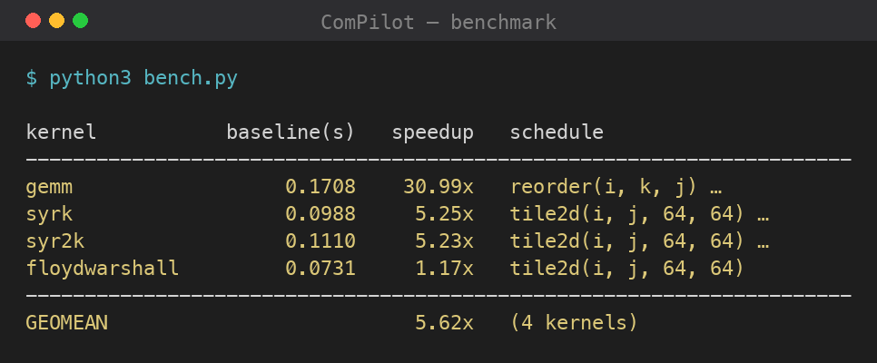
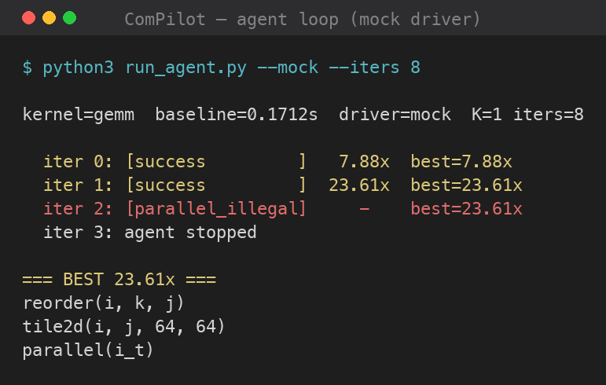

# Test results

All suites pass and the benchmark is reproducible. Captured on a multi-core macOS / Apple-Silicon machine — **speedups are machine-dependent; legality verdicts are not.** Regenerate everything with the commands shown.

## Test suite

```bash
for t in legality environment multistatement tiramisu_parity; do python3 -m tests.test_$t; done
```


| Suite | Result |
|---|---|
| `test_legality` — ISL oracle distinguishes legal vs illegal | **10/10** — accepts interchange/tile/skew; rejects `reverse(k)`; flags `parallel(k)` non-parallelizable |
| `test_environment` — legality + real measured speedup on GEMM | baseline ≈0.17 s; `reorder(i,k,j)` ≈7.7×; `tile2d+parallel` ≈11–14×; `reverse(k)`→illegal; `parallel(k)`→parallel_illegal |
| `test_multistatement` — producer→consumer legality | **3/3** — fused legal, distributed legal, reordered (consumer-first) illegal |
| `test_tiramisu_parity` — ISL vs the **real Tiramisu compiler** | **4/4 agree** — interchange, `reverse(k)`=illegal, `reverse(i)`, tile2d |

## Benchmark

One strong, legal schedule per kernel — deterministic, no LLM (`clang -O3 + OpenMP`):

```bash
python3 bench.py
```



| Kernel | Baseline | Speedup | Schedule |
|---|---|---|---|
| gemm | ~0.17 s | **~26–31×** | `reorder(i,k,j)` + `tile2d(64,64)` + `parallel(i_t)` |
| syrk | ~0.10 s | **~5×** | `tile2d(64,64)` + `parallel(i_t)` |
| syr2k | ~0.11 s | **~5×** | `tile2d(64,64)` + `parallel(i_t)` |
| floydwarshall | ~0.07 s | **~1×** | `tile2d(64,64)` — *cannot* parallelize under sound legality |
| **geomean** | | **~5×** | |

Floyd-Warshall at ~1× is the honest, *correct* result: row/column `k` is written and read across iterations, so sound polyhedral analysis forbids parallelizing `i`/`j` (only the non-negative-diagonal *semantics* would allow it, which a syntactic checker cannot assume — Pluto is conservative here too).

## Agent loop (live behaviour, mock driver shown)

```bash
python3 run_agent.py --mock --iters 8     # deterministic, no API key
```



With **live Gemini** the agent tailors schedules per kernel and reaches **42× on GEMM** and a **~13× geomean** (`python3 run_agent.py --iters 15`, key from env or OpenBao).

## Evaluation metrics (RQ1 / RQ2 / RQ9)

`evaluate.py` runs a pool of independent dialogues per kernel and reports the paper's metrics: **ComPilot@T** (median single-run speedup), **ComPilot_K@T** (typical best-of-K), bootstrap **95% CIs**, geometric mean, and **token/cost** (RQ2).

```bash
python3 evaluate.py --mock --pool 6 --k 5 --iters 8        # deterministic
python3 evaluate.py --kernels gemm --pool 2 --k 2 --iters 6  # live (real tokens)
```

Mock pool (variance from measurement timing):

```
gemm    ComPilot@8=28.9x  ComPilot_5@8=37.8x  95%CI=[27.5, 35.7]
syrk    ComPilot@8= 3.2x  ComPilot_5@8= 3.5x  95%CI=[ 3.1,  3.4]
syr2k   ComPilot@8= 1.8x  ComPilot_5@8= 2.1x  95%CI=[ 1.7,  2.0]
floyd   ComPilot@8= 1.0x  ComPilot_5@8= 1.0x  95%CI=[ 1.0,  1.0]
GEOMEAN ComPilot@8= 3.6x  ComPilot_5@8= 4.1x  95%CI=[1.33, 14.40]
```

Live (RQ2 cost) — a full GEMM dialogue is **~$0.005** on `gemini-2.5-flash`:

```
gemm  ComPilot@6=34.1x  ComPilot_2@6=39.6x  95%CI=[28.7, 39.6]
RQ2 tokens: in=15,119 out=2,087  est. cost $0.0098 (2 runs)
```

> Bootstrap CIs are reproducible (fixed-seed RNG). The wide geomean CI honestly reflects bootstrapping over only 4 kernels with one large outlier (GEMM).
