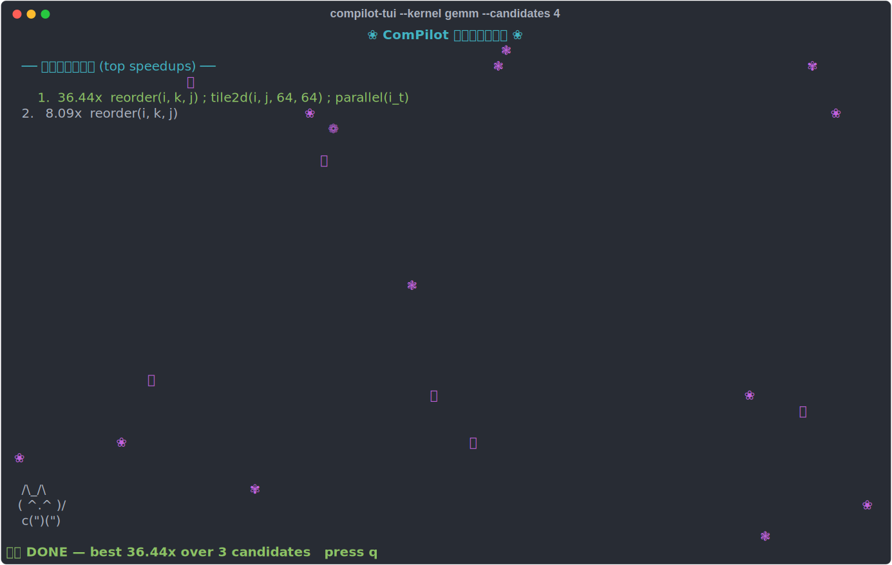
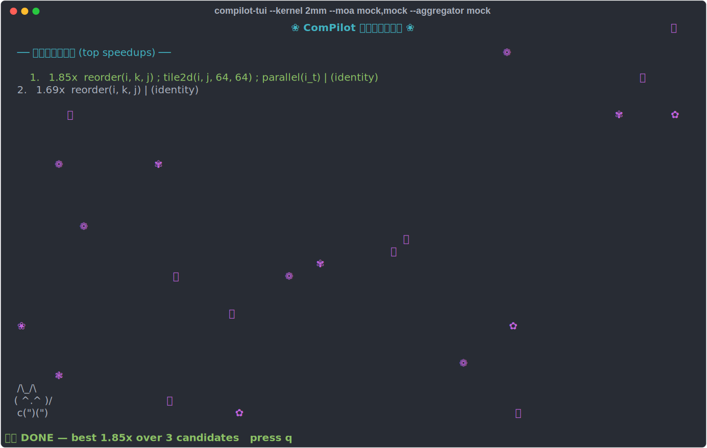

# User guide (step by step)

## Run the agent

```bash
# 1. Full agent loop without a key (scripted driver)
python3 run_agent.py --mock

# 2. Live on GEMM (key from env or OpenBao)
python3 run_agent.py --iters 15

# 3. Choose a kernel and use best-of-K
python3 run_agent.py --kernel syrk --k 5 --iters 20
```

`run_agent.py` flags: `--kernel {gemm,syrk,syr2k,floydwarshall}` · `--iters N` (max dialogue turns) · `--k N` (best-of-K runs) · `--model gemini-2.5-flash` · `--mock`.

## Live monitor (TUI)

Watch the search in real time — a speedup leaderboard fills in as candidates are compiled and measured, while sakura petals drift and a maneki-neko waves on each new record. Installed as `compilot-tui` by `pip install -e .`.

```bash
compilot-tui --kernel gemm --candidates 4          # single-statement, mock backend (offline)
compilot-tui --kernel syrk --backend gemini --iters 15
```



It also follows **multi-statement kernels and Mixture-of-Agents fan-out** — every measured schedule set streams into the same board (`--moa` reference specs are the same as `run_agent.py`; `mock,mock` runs offline):

```bash
compilot-tui --kernel 2mm --moa mock,mock --aggregator mock
compilot-tui --kernel 2mm --moa "gemini:gemini-2.5-flash,local:qwen2.5-coder:32b" --aggregator gemini:gemini-2.5-pro
```



`q` quits. The monitor reads candidates via a lightweight `on_eval` hook on the dialogue runners, so it adds nothing to the search itself.

## MCP server (Claude Code / Codex)

Drive the optimizer in natural language from an MCP client. Installed as `compilot-mcp`; tools: `list_kernels`, `check_legality(kernel, schedule)` (ISL verdict + measured speedup, sub-second), `optimize(kernel, backend=mock, …)` (the full agent loop).

```bash
COMPILOT_PYTHON=$PWD/.venv/bin/python claude mcp add compilot -- npx -y @cluster2600/compilot-mcp
```

See [`npm/README.md`](../npm/README.md) for the Codex `config.toml` form and details.

## Evaluate across kernels

```bash
python3 evaluate.py --mock                     # deterministic, all kernels (+ pool/CIs/cost)
python3 evaluate.py --kernels gemm,syrk --k 3  # live Gemini, best-of-3
python3 bench.py                               # deterministic benchmark (one schedule per kernel)
```

## Run the tests

```bash
python3 -m tests.test_legality
python3 -m tests.test_environment
python3 -m tests.test_multistatement
python3 -m tests.test_tiramisu_parity      # needs the Tiramisu build (see Building, step 5)
```

## Write a schedule by hand

The 9-primitive DSL (one transform per line; loop labels are the loop variable names, tiling `L` creates `L_t`):

```
reorder(i, k, j)
tile2d(i, j, 64, 64)
parallel(i_t)
unroll(k, 4)
```

Evaluate it directly:

```python
from compilot.backend_isl import environment
env = environment("gemm")
r = env.evaluate("reorder(i, k, j)\ntile2d(i, j, 64, 64)\nparallel(i_t)")
print(r.status, r.speedup)        # success 26.5
```

## Add your own kernel

In `compilot/kernels.py`, pair an execution spec (`Kernel`) with a polyhedral spec (`PolyKernel`) and register it:

```python
MYK = Kernel(name="myk", sizes={...}, arrays={...}, loops=[("i","N"),...],
             body="C[...] += ...;", output="C", reduction={"k"})
MYK_POLY = PolyKernel(name="myk", order=["i","j","k"], domain="0<=i<N and ...",
                      writes=[("C","i,j")], reads=[...], params=["N",...])
REGISTRY["myk"] = (MYK, MYK_POLY)
```

The agent, `evaluate.py`, `bench.py`, and the legality engine all pick it up by name. Use `GEMM` / `GEMM_POLY` as the template. Multi-statement kernels use `compilot/polyhedral_multi.py`.
